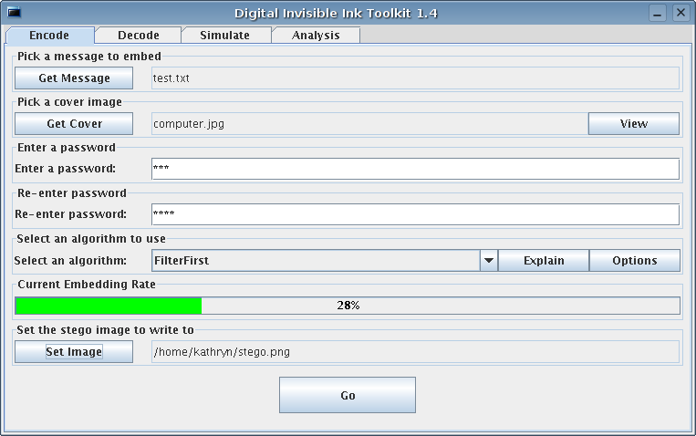
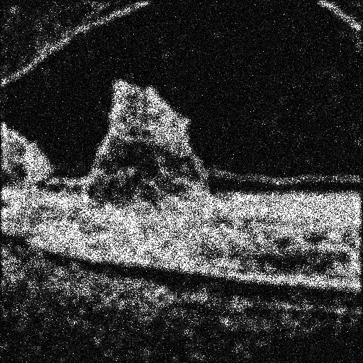
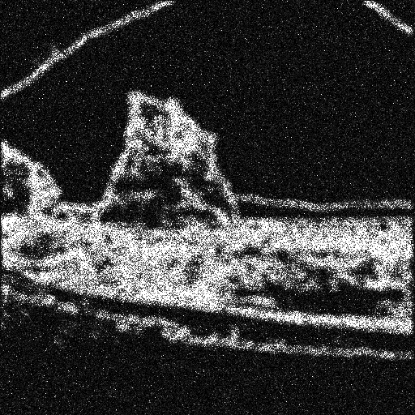
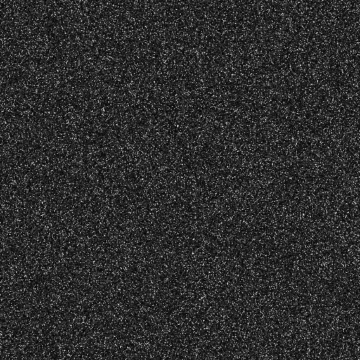
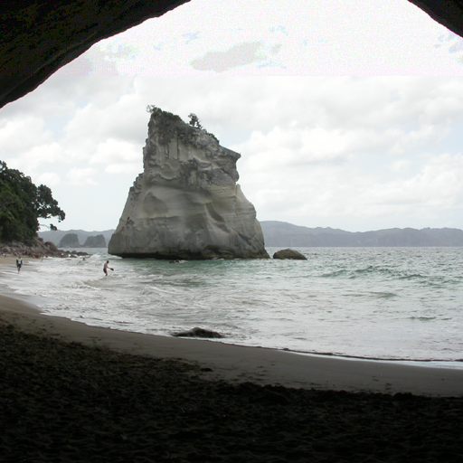
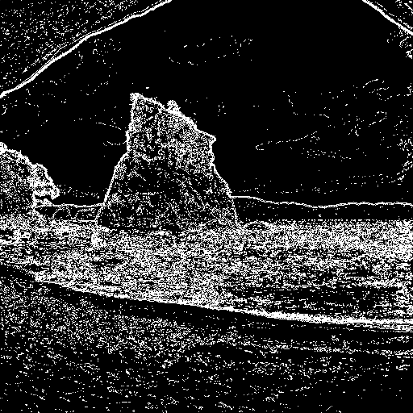
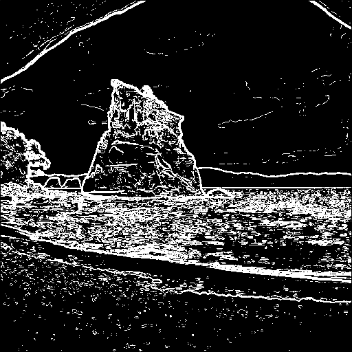

# Digital Invisible Ink Toolkit (diit)

The Digital Invisible Ink Toolkit is a Java steganography tool that can hide any sort of file inside a digital image (regarding that the message will fit, and the image is 24 bit colour). It will work on Windows, Linux and Mac OS because it is written in Java and thus platform independent.

There are four highly customisable algorithms in the tool, as well as an open-source implementation of RS Analysis (an extremely good steganalysis method). The tool has the additional advantage of being able to simulate hiding - so you can get an accurate map of where the information is hidden.

The compiled version can be run by simply double clicking the .jar file (in Windows), or by running at a command line with the following options (you will need to run at the command line if you are using big pictures, such as those greater than 500x500 pixels or it will run out of memory). You can download the precompiled jar file [directly from SourceForge](http://diit.sourceforge.net/download.php).

## Pre-requisites

You will need a Java virtual machine installed. This is common software, free for personal use, and if you do not have it already installed you can download a copy from the [Java website](https://www.java.com/en/download/manual.jsp).

## Running pre-compiled version

You can download the precompiled jar file [directly from SourceForge](http://diit.sourceforge.net/download.php), and then double-click it to run the toolkit.



## Running from source

After cloning this git repository, you can run the GUI from source from this directory with:

```bash
java -Xmx1024m invisibleinktoolkit.Run
```

The `-Xmx1024m` tells the Java VM to use 1024MB of RAM - this is important because unfortunately the program is not wonderfully memory efficient and on large modern images it will quickly choke. Change 1024 for whatever is appropriate for your system.

## Algorithm / hiding recommendations

For effective hiding, keep embedding rates <= 10%. Use FilterFirst with Sobel filter, and turn on LSB matching. The [original research](HidingBehindCorners.pdf) showed FilterFirst was undetectable up until embedding rates of 7%, using the most advanced published steganalysis techniques available at the time (2005).

Ideally use images for hiding that are busy and have a lot of edges - if there are large blocks of colour you risk the image being visibly degraded which may indicate something is hidden it in.

The transformations performed by this tool are fragile; image compression, cropping, and pixel modification destroy the steganography and make the hidden file impossible to retrieve. Image rotation should be okay provided the image is in its original state when 

## How it works

The idea behind the toolkit is that we take a picture, below we take cove.png, and insert into it a message by changing the colours of the pixels slightly. Because the changes made are so small, it's hard for the human eye to see the difference. Because of the way the algorithms hide it, it should be hard for a computer to tell the difference too. Benchmarking is provided in the tool to prove this is the case.

Shown below are examples of each algorithm run using the 4 least significant bits of the colour information, and embedding exactly the same file.


| Algorithm | Stego image | Hiding Map |
| ----------| ----------- | ---------- |
| **Untouched Image** |  | |
| **BattleSteg (Laplace Filter)** |  |  |
| **BattleSteg (Sobel Filter)** |  |  |
| **Hide and Seek** |  |  |
| **BlindHide** |  |  |
| **FilterFirst (Laplace Filter)** |  |  |
| **FilterFirst (Sobel Filter)** |  |  |

---

## Further documentation and changes

Further documentation can be found at [the original SourceForge site](http://diit.sourceforge.net/index.html).

This project is not actively developed, but forks and pull requests are welcome. This code is licensed with the GNU Public License V2.